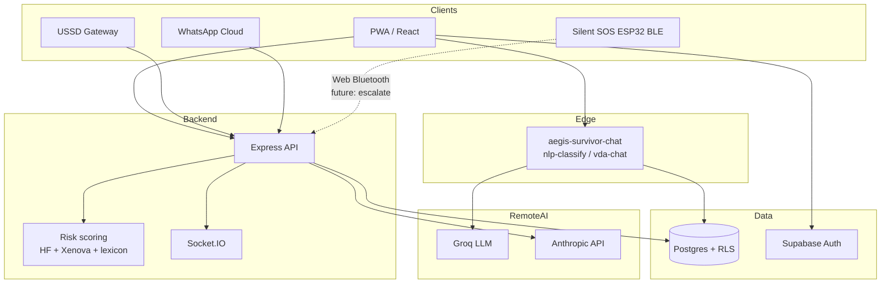

# AEGIS-AI — System architecture

Single-repo full-stack TypeScript application: **React / Vite** SPA, **Node / Express** API, **Supabase** (Postgres + Auth + Edge Functions), optional **Redis** for rate limits, sessions, and queues. Channels: **web**, **USSD**, **WhatsApp**. POPIA-first data handling and South African crisis numeracy (10111, 0800 428 428) are first-class.

## Logical view

## Key runtime paths

| Path                                 | Role                                                                                                |
| ------------------------------------ | --------------------------------------------------------------------------------------------------- |
| `POST /api/ussd/test`                | Local USSD smoke (`npm run ussd:local`)                                                             |
| `POST /api/ussd/telkom/callback`     | Production Telkom-signed webhook                                                                    |
| `GET/POST /api/whatsapp/*`           | Meta WhatsApp Business webhooks                                                                     |
| `POST` survivor chat (edge)          | `supabase/functions/aegis-survivor-chat` — Groq + encrypted persistence in `survivor_chat_messages` |
| `server/intelligence/riskScoring.ts` | Severity: Hugging Face + Xenova + heuristics                                                        |
| `server/routes/whatsappRoutes.ts`    | Anthropic Haiku triage; sessions in **Redis** when `REDIS_URL` / `REDIS_HOST` set                   |

## Data stores

- **PostgreSQL**: canonical cases, survivors, chat sessions (`survivor_chat_sessions` + `chat_messages`), justice workflows, audit.
- **`survivor_chat_messages`**: edge-function encrypted rows keyed by `auth.users` (`user_id`); migration `20260430140000_survivor_chat_messages_edge.sql`. Supports POPIA `delete_data` from the edge function.
- **Redis**: rate limiting (prod), BullMQ plumbing, **WhatsApp session** JSON blobs (`aegis:wa:session:<E164>`).

## Observability & deploy

- Prometheus metrics, optional Sentry / Datadog (see `DEPLOYMENT.md`).
- Container images: `Dockerfile.backend`, `Dockerfile.frontend.nginx`.
- K8s manifests under `kubernetes/`; staging via `render.yaml`.

## Firmware (competition robotics angle)

- `firmware/silent-sos-esp32/`: ESP32-C3 BLE panic → PWA bridge (`/demo/silent-sos`).

## Related docs

- `AGENTS.md` — repo map and commands
- `DEPLOYMENT.md` — canonical targets
- `SECURITY.md` — secrets and compliance checklist
- `RUNBOOK.md` / `OPERATOR_PLAYBOOK.md` — operations
