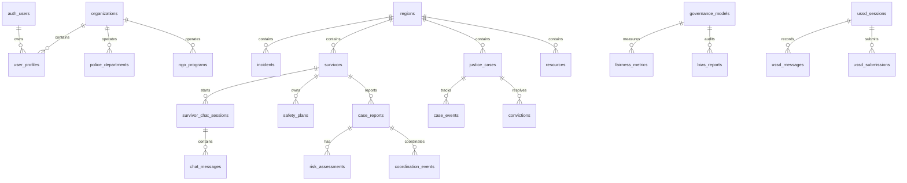

# AEGIS-AI App Schemas

**Scope:** Database, API payload, realtime, offline-sync, and mobile-facing validation schemas for the AEGIS-AI platform.

**Primary sources:**

- `./supabase/migrations/001_create_aegis_schema.sql`
- `./supabase/migrations/20260218_add_survivor_registration.sql`
- `./supabase/migrations/20260222_phase1_core_architecture.sql`
- `./supabase/migrations/20260321193000_harden_ussd_runtime_schema.sql`
- `./supabase/migrations/20260327110000_restore_org_role_tables.sql`
- `./supabase/migrations/20260430140000_survivor_chat_messages_edge.sql`
- `./supabase/migrations/20260524000000_peer_support_messages.sql`
- `./src/lib/supabase.ts`

---

## 1. Domain Model



---

## 2. Core Database Schemas

### 2.1 Identity and Organizations

#### `organizations`

```sql
CREATE TABLE organizations (
  id UUID PRIMARY KEY DEFAULT gen_random_uuid(),
  name TEXT NOT NULL UNIQUE,
  country TEXT NOT NULL,
  region TEXT,
  type TEXT NOT NULL,
  description TEXT,
  website TEXT,
  subscription_level TEXT DEFAULT 'Standard',
  is_verified BOOLEAN DEFAULT FALSE,
  verification_status TEXT DEFAULT 'pending',
  verified_at TIMESTAMPTZ,
  verified_by UUID REFERENCES auth.users(id),
  contact_email TEXT,
  phone TEXT,
  created_at TIMESTAMPTZ DEFAULT CURRENT_TIMESTAMP,
  updated_at TIMESTAMPTZ DEFAULT CURRENT_TIMESTAMP
);
```

#### `user_profiles`

```sql
CREATE TABLE user_profiles (
  id UUID PRIMARY KEY REFERENCES auth.users(id) ON DELETE CASCADE,
  organization_id UUID REFERENCES organizations(id) ON DELETE SET NULL,
  role TEXT NOT NULL DEFAULT 'analyst',
  full_name TEXT,
  email TEXT,
  avatar_url TEXT,
  is_active BOOLEAN DEFAULT TRUE,
  approval_status TEXT DEFAULT 'pending',
  mfa_enabled BOOLEAN DEFAULT FALSE,
  approved_by UUID REFERENCES auth.users(id) ON DELETE SET NULL,
  role_assigned_by UUID REFERENCES auth.users(id) ON DELETE SET NULL,
  approved_at TIMESTAMPTZ,
  created_at TIMESTAMPTZ DEFAULT CURRENT_TIMESTAMP,
  updated_at TIMESTAMPTZ DEFAULT CURRENT_TIMESTAMP
);
```

#### `police_departments`

```sql
CREATE TABLE police_departments (
  id UUID PRIMARY KEY DEFAULT gen_random_uuid(),
  organization_id UUID NOT NULL REFERENCES organizations(id) ON DELETE CASCADE,
  region_id UUID NOT NULL REFERENCES regions(id) ON DELETE CASCADE,
  department_name TEXT NOT NULL,
  jurisdiction_level TEXT NOT NULL DEFAULT 'district',
  jurisdiction_name TEXT NOT NULL,
  officers_count INTEGER DEFAULT 0,
  contact_email TEXT,
  contact_phone TEXT,
  is_active BOOLEAN DEFAULT TRUE,
  created_at TIMESTAMPTZ DEFAULT CURRENT_TIMESTAMP,
  updated_at TIMESTAMPTZ DEFAULT CURRENT_TIMESTAMP
);
```

#### `ngo_programs`

```sql
CREATE TABLE ngo_programs (
  id UUID PRIMARY KEY DEFAULT gen_random_uuid(),
  organization_id UUID NOT NULL REFERENCES organizations(id) ON DELETE CASCADE,
  program_name TEXT NOT NULL,
  program_type TEXT NOT NULL,
  focus_areas TEXT[] NOT NULL DEFAULT '{}',
  region_ids UUID[] NOT NULL DEFAULT '{}',
  description TEXT,
  target_beneficiaries TEXT,
  contact_person TEXT,
  contact_email TEXT,
  contact_phone TEXT,
  is_active BOOLEAN DEFAULT TRUE,
  created_at TIMESTAMPTZ DEFAULT CURRENT_TIMESTAMP,
  updated_at TIMESTAMPTZ DEFAULT CURRENT_TIMESTAMP
);
```

---

### 2.2 Regions, Resources, and Incidents

#### `regions`

```sql
CREATE TABLE regions (
  id UUID PRIMARY KEY DEFAULT gen_random_uuid(),
  name TEXT NOT NULL,
  country TEXT NOT NULL,
  risk_level TEXT NOT NULL DEFAULT 'low',
  risk_score DECIMAL(5,2) DEFAULT 0,
  incidents INTEGER DEFAULT 0,
  trend TEXT NOT NULL DEFAULT 'stable',
  trend_percent DECIMAL(5,2) DEFAULT 0,
  latitude DECIMAL(10,8),
  longitude DECIMAL(11,8),
  population INTEGER,
  active_shelters INTEGER DEFAULT 0,
  active_agents INTEGER DEFAULT 0,
  last_incident_date TIMESTAMPTZ,
  created_at TIMESTAMPTZ DEFAULT CURRENT_TIMESTAMP,
  updated_at TIMESTAMPTZ DEFAULT CURRENT_TIMESTAMP
);
```

#### `resources`

```sql
CREATE TABLE resources (
  id UUID PRIMARY KEY DEFAULT gen_random_uuid(),
  region_id UUID REFERENCES regions(id) ON DELETE CASCADE,
  resource_type TEXT NOT NULL,
  name TEXT NOT NULL,
  description TEXT,
  contact_info TEXT,
  latitude DECIMAL(10,8),
  longitude DECIMAL(11,8),
  available_24_7 BOOLEAN DEFAULT FALSE,
  languages_spoken TEXT[],
  created_at TIMESTAMPTZ DEFAULT CURRENT_TIMESTAMP,
  updated_at TIMESTAMPTZ DEFAULT CURRENT_TIMESTAMP
);
```

#### `incidents`

```sql
CREATE TABLE incidents (
  id UUID PRIMARY KEY DEFAULT gen_random_uuid(),
  region_id UUID NOT NULL REFERENCES regions(id) ON DELETE CASCADE,
  incident_type TEXT NOT NULL,
  description TEXT,
  severity TEXT NOT NULL DEFAULT 'moderate',
  reported_by UUID REFERENCES auth.users(id) ON DELETE SET NULL,
  anonymous BOOLEAN DEFAULT TRUE,
  latitude DECIMAL(10,8),
  longitude DECIMAL(11,8),
  incident_date TIMESTAMPTZ NOT NULL,
  created_at TIMESTAMPTZ DEFAULT CURRENT_TIMESTAMP,
  updated_at TIMESTAMPTZ DEFAULT CURRENT_TIMESTAMP
);
```

---

### 2.3 Survivor Support

#### `survivors`

```sql
CREATE TABLE survivors (
  id UUID PRIMARY KEY DEFAULT gen_random_uuid(),
  user_id UUID UNIQUE REFERENCES auth.users(id) ON DELETE CASCADE,
  anonymous_id TEXT UNIQUE,
  date_of_birth DATE,
  region_id UUID REFERENCES regions(id) ON DELETE SET NULL,
  incident_types TEXT[],
  current_risk_level TEXT DEFAULT 'low',
  safety_plan_exists BOOLEAN DEFAULT FALSE,
  support_status TEXT DEFAULT 'active',
  last_contact TIMESTAMPTZ,
  created_at TIMESTAMPTZ DEFAULT CURRENT_TIMESTAMP,
  updated_at TIMESTAMPTZ DEFAULT CURRENT_TIMESTAMP
);
```

#### `survivor_location_records`

```sql
CREATE TABLE survivor_location_records (
  id UUID PRIMARY KEY DEFAULT gen_random_uuid(),
  survivor_id UUID NOT NULL REFERENCES survivors(id) ON DELETE CASCADE,
  encrypted_payload TEXT NOT NULL,
  iv TEXT NOT NULL,
  key_version TEXT DEFAULT 'v1',
  created_at TIMESTAMPTZ DEFAULT CURRENT_TIMESTAMP
);
```

#### `survivor_risk_profiles`

```sql
CREATE TABLE survivor_risk_profiles (
  id UUID PRIMARY KEY DEFAULT gen_random_uuid(),
  survivor_id UUID NOT NULL REFERENCES survivors(id) ON DELETE CASCADE,
  risk_level TEXT NOT NULL,
  risk_score DECIMAL(5,2) NOT NULL,
  factors JSONB,
  created_at TIMESTAMPTZ DEFAULT CURRENT_TIMESTAMP
);
```

#### `safety_plans`

```sql
CREATE TABLE safety_plans (
  id UUID PRIMARY KEY DEFAULT gen_random_uuid(),
  survivor_id UUID NOT NULL REFERENCES survivors(id) ON DELETE CASCADE,
  trusted_contacts TEXT[],
  safe_locations TEXT[],
  emergency_resources TEXT[],
  identified_triggers TEXT[],
  coping_strategies TEXT[],
  created_at TIMESTAMPTZ DEFAULT CURRENT_TIMESTAMP,
  updated_at TIMESTAMPTZ DEFAULT CURRENT_TIMESTAMP
);
```

---

### 2.4 Chat, Peer Support, and Counseling

#### `survivor_chat_sessions`

```sql
CREATE TABLE survivor_chat_sessions (
  id UUID PRIMARY KEY DEFAULT gen_random_uuid(),
  survivor_id UUID REFERENCES survivors(id) ON DELETE CASCADE,
  anonymous BOOLEAN DEFAULT TRUE,
  mood_baseline TEXT DEFAULT 'neutral',
  risk_level_start TEXT,
  risk_level_end TEXT,
  conversation_summary TEXT,
  consent_granted BOOLEAN DEFAULT FALSE,
  consent_granted_at TIMESTAMPTZ,
  retention_expires_at TIMESTAMPTZ,
  escalated_to_counselor BOOLEAN DEFAULT FALSE,
  escalated_at TIMESTAMPTZ,
  counselor_id UUID REFERENCES auth.users(id) ON DELETE SET NULL,
  created_at TIMESTAMPTZ DEFAULT CURRENT_TIMESTAMP,
  updated_at TIMESTAMPTZ DEFAULT CURRENT_TIMESTAMP,
  ended_at TIMESTAMPTZ
);
```

#### `chat_messages`

```sql
CREATE TABLE chat_messages (
  id UUID PRIMARY KEY DEFAULT gen_random_uuid(),
  session_id UUID NOT NULL REFERENCES survivor_chat_sessions(id) ON DELETE CASCADE,
  role TEXT NOT NULL,
  content TEXT NOT NULL,
  encrypted_content TEXT,
  is_encrypted BOOLEAN DEFAULT FALSE,
  metadata JSONB,
  emotion_detected TEXT,
  risk_score DECIMAL(3,2),
  language TEXT DEFAULT 'en',
  created_at TIMESTAMPTZ DEFAULT CURRENT_TIMESTAMP
);
```

#### `survivor_chat_messages`

```sql
CREATE TABLE survivor_chat_messages (
  id UUID PRIMARY KEY DEFAULT gen_random_uuid(),
  session_id TEXT NOT NULL,
  user_id UUID NOT NULL REFERENCES auth.users(id) ON DELETE CASCADE,
  message_encrypted TEXT NOT NULL,
  role TEXT NOT NULL DEFAULT 'user',
  risk_level TEXT,
  emotion_detected TEXT,
  created_at TIMESTAMPTZ NOT NULL DEFAULT CURRENT_TIMESTAMP,
  expires_at TIMESTAMPTZ
);
```

#### `peer_support_messages`

```sql
CREATE TABLE peer_support_messages (
  id UUID PRIMARY KEY DEFAULT gen_random_uuid(),
  alias TEXT NOT NULL CHECK (char_length(alias) <= 100),
  content TEXT NOT NULL CHECK (char_length(content) BETWEEN 1 AND 280),
  flagged BOOLEAN NOT NULL DEFAULT FALSE,
  created_at TIMESTAMPTZ NOT NULL DEFAULT CURRENT_TIMESTAMP,
  expires_at TIMESTAMPTZ NOT NULL DEFAULT (CURRENT_TIMESTAMP + INTERVAL '7 days')
);
```

---

### 2.5 Cases, Risk, and Escalation

#### `case_reports`

```sql
CREATE TABLE case_reports (
  id UUID PRIMARY KEY DEFAULT gen_random_uuid(),
  survivor_id UUID REFERENCES survivors(id) ON DELETE SET NULL,
  source TEXT NOT NULL,
  status TEXT NOT NULL DEFAULT 'open',
  risk_level TEXT NOT NULL DEFAULT 'low',
  risk_score DECIMAL(5,2) DEFAULT 0,
  priority TEXT NOT NULL DEFAULT 'medium',
  description TEXT,
  encrypted_location TEXT,
  location_iv TEXT,
  created_at TIMESTAMPTZ DEFAULT CURRENT_TIMESTAMP,
  updated_at TIMESTAMPTZ DEFAULT CURRENT_TIMESTAMP
);
```

#### `risk_assessments`

```sql
CREATE TABLE risk_assessments (
  id UUID PRIMARY KEY DEFAULT gen_random_uuid(),
  case_id UUID NOT NULL REFERENCES case_reports(id) ON DELETE CASCADE,
  risk_level TEXT NOT NULL,
  risk_score DECIMAL(5,2) NOT NULL,
  factors JSONB,
  created_at TIMESTAMPTZ DEFAULT CURRENT_TIMESTAMP
);
```

#### `coordination_events`

```sql
CREATE TABLE coordination_events (
  id UUID PRIMARY KEY DEFAULT gen_random_uuid(),
  case_id UUID NOT NULL REFERENCES case_reports(id) ON DELETE CASCADE,
  target_role TEXT NOT NULL,
  status TEXT NOT NULL DEFAULT 'pending',
  notified_at TIMESTAMPTZ,
  responded_at TIMESTAMPTZ,
  created_at TIMESTAMPTZ DEFAULT CURRENT_TIMESTAMP
);
```

#### `escalation_events`

```sql
CREATE TABLE escalation_events (
  id UUID PRIMARY KEY DEFAULT gen_random_uuid(),
  case_id UUID NOT NULL REFERENCES case_reports(id) ON DELETE CASCADE,
  triggered_by UUID NOT NULL REFERENCES auth.users(id),
  escalation_type VARCHAR(50) NOT NULL,
  severity VARCHAR(20) NOT NULL CHECK (severity IN ('low', 'medium', 'high', 'critical')),
  reason TEXT,
  location JSONB,
  status VARCHAR(20) NOT NULL DEFAULT 'pending',
  acknowledged_by UUID REFERENCES auth.users(id),
  acknowledged_at TIMESTAMP,
  resolved_at TIMESTAMP,
  metadata JSONB,
  created_at TIMESTAMP DEFAULT NOW()
);
```

---

### 2.6 Justice Workflow

#### `justice_cases`

```sql
CREATE TABLE justice_cases (
  id UUID PRIMARY KEY DEFAULT gen_random_uuid(),
  case_number TEXT UNIQUE NOT NULL,
  case_type TEXT NOT NULL,
  region_id UUID REFERENCES regions(id) ON DELETE SET NULL,
  status TEXT NOT NULL DEFAULT 'open',
  stage TEXT,
  assigned_to UUID REFERENCES auth.users(id) ON DELETE SET NULL,
  assigned_police_department_id UUID REFERENCES police_departments(id) ON DELETE SET NULL,
  assigned_ngo_program_id UUID REFERENCES ngo_programs(id) ON DELETE SET NULL,
  priority TEXT NOT NULL DEFAULT 'medium',
  days_open INTEGER DEFAULT 0,
  created_at TIMESTAMPTZ DEFAULT CURRENT_TIMESTAMP,
  updated_at TIMESTAMPTZ DEFAULT CURRENT_TIMESTAMP,
  closed_at TIMESTAMPTZ
);
```

#### `case_events`

```sql
CREATE TABLE case_events (
  id UUID PRIMARY KEY DEFAULT gen_random_uuid(),
  case_id UUID NOT NULL REFERENCES justice_cases(id) ON DELETE CASCADE,
  event_type TEXT NOT NULL,
  description TEXT,
  event_date TIMESTAMPTZ NOT NULL,
  created_by UUID REFERENCES auth.users(id) ON DELETE SET NULL,
  created_at TIMESTAMPTZ DEFAULT CURRENT_TIMESTAMP
);
```

#### `convictions`

```sql
CREATE TABLE convictions (
  id UUID PRIMARY KEY DEFAULT gen_random_uuid(),
  case_id UUID NOT NULL REFERENCES justice_cases(id) ON DELETE CASCADE,
  verdict TEXT NOT NULL,
  sentence_type TEXT,
  sentence_length TEXT,
  appeal_status TEXT DEFAULT 'none',
  conviction_date TIMESTAMPTZ NOT NULL,
  created_at TIMESTAMPTZ DEFAULT CURRENT_TIMESTAMP
);
```

---

### 2.7 Analytics and Governance

#### `risk_predictions`

```sql
CREATE TABLE risk_predictions (
  id UUID PRIMARY KEY DEFAULT gen_random_uuid(),
  region_id UUID NOT NULL REFERENCES regions(id) ON DELETE CASCADE,
  forecast_date TIMESTAMPTZ NOT NULL,
  predicted_risk_level TEXT NOT NULL,
  predicted_incidents INTEGER,
  confidence DECIMAL(3,2),
  model_version TEXT,
  created_at TIMESTAMPTZ DEFAULT CURRENT_TIMESTAMP
);
```

#### `governance_models`

```sql
CREATE TABLE governance_models (
  id UUID PRIMARY KEY DEFAULT gen_random_uuid(),
  name TEXT NOT NULL,
  version TEXT NOT NULL,
  module TEXT NOT NULL,
  status TEXT DEFAULT 'active',
  accuracy DECIMAL(3,2),
  fairness_score DECIMAL(3,2),
  drift_detected BOOLEAN DEFAULT FALSE,
  last_audit_date TIMESTAMPTZ,
  created_at TIMESTAMPTZ DEFAULT CURRENT_TIMESTAMP,
  updated_at TIMESTAMPTZ DEFAULT CURRENT_TIMESTAMP
);
```

#### `fairness_metrics`

```sql
CREATE TABLE fairness_metrics (
  id UUID PRIMARY KEY DEFAULT gen_random_uuid(),
  model_id UUID NOT NULL REFERENCES governance_models(id) ON DELETE CASCADE,
  demographic_group TEXT,
  metric_name TEXT,
  metric_value DECIMAL(5,2),
  status TEXT DEFAULT 'pass',
  created_at TIMESTAMPTZ DEFAULT CURRENT_TIMESTAMP
);
```

#### `bias_reports`

```sql
CREATE TABLE bias_reports (
  id UUID PRIMARY KEY DEFAULT gen_random_uuid(),
  model_id UUID NOT NULL REFERENCES governance_models(id) ON DELETE CASCADE,
  finding TEXT NOT NULL,
  severity TEXT NOT NULL,
  recommendation TEXT,
  remediation_status TEXT DEFAULT 'pending',
  created_at TIMESTAMPTZ DEFAULT CURRENT_TIMESTAMP
);
```

---

### 2.8 USSD and Emergency Fallback

#### `ussd_sessions`

```sql
CREATE TABLE ussd_sessions (
  id UUID DEFAULT gen_random_uuid(),
  session_id VARCHAR(255) PRIMARY KEY,
  phone_number VARCHAR(20),
  user_id UUID REFERENCES auth.users(id) ON DELETE SET NULL,
  user_role VARCHAR(50),
  current_menu VARCHAR(100),
  state TEXT,
  last_input TEXT,
  payload JSONB,
  metadata JSONB DEFAULT '{}',
  created_at TIMESTAMPTZ DEFAULT NOW(),
  updated_at TIMESTAMPTZ DEFAULT NOW(),
  last_accessed_at TIMESTAMPTZ DEFAULT NOW(),
  expires_at TIMESTAMPTZ DEFAULT (NOW() + INTERVAL '5 minutes'),
  is_active BOOLEAN DEFAULT TRUE
);
```

#### `ussd_messages`

```sql
CREATE TABLE ussd_messages (
  id UUID PRIMARY KEY DEFAULT gen_random_uuid(),
  session_id VARCHAR(255) NOT NULL REFERENCES ussd_sessions(session_id) ON DELETE CASCADE,
  direction VARCHAR(20) NOT NULL CHECK (direction IN ('inbound', 'outbound')),
  content TEXT NOT NULL,
  menu_level VARCHAR(50) NOT NULL,
  timestamp TIMESTAMPTZ DEFAULT NOW(),
  status VARCHAR(50) DEFAULT 'delivered',
  error_message TEXT,
  created_at TIMESTAMPTZ DEFAULT NOW()
);
```

#### `ussd_submissions`

```sql
CREATE TABLE ussd_submissions (
  id UUID PRIMARY KEY DEFAULT gen_random_uuid(),
  session_id VARCHAR(255) NOT NULL REFERENCES ussd_sessions(session_id) ON DELETE CASCADE,
  menu_level VARCHAR(50) NOT NULL,
  menu_code VARCHAR(10) NOT NULL,
  user_input TEXT,
  timestamp TIMESTAMPTZ DEFAULT NOW(),
  status VARCHAR(50) DEFAULT 'pending',
  processed_by UUID REFERENCES auth.users(id) ON DELETE SET NULL,
  processed_at TIMESTAMPTZ,
  response_message TEXT,
  created_at TIMESTAMPTZ DEFAULT NOW()
);
```

---

### 2.9 Security, Audit, and Compliance

#### `audit_logs`

```sql
CREATE TABLE audit_logs (
  id UUID PRIMARY KEY DEFAULT gen_random_uuid(),
  user_id UUID REFERENCES auth.users(id) ON DELETE SET NULL,
  action VARCHAR(100) NOT NULL,
  resource VARCHAR(100),
  resource_id UUID,
  module TEXT,
  description TEXT,
  severity TEXT DEFAULT 'info',
  status VARCHAR(50),
  details JSONB DEFAULT '{}',
  ip_address INET,
  user_agent TEXT,
  timestamp TIMESTAMPTZ DEFAULT NOW(),
  created_at TIMESTAMPTZ DEFAULT NOW()
);
```

#### `audit_logs_immutable`

```sql
CREATE TABLE audit_logs_immutable (
  id UUID PRIMARY KEY DEFAULT gen_random_uuid(),
  user_id UUID REFERENCES auth.users(id) ON DELETE SET NULL,
  action VARCHAR(100) NOT NULL,
  module VARCHAR(50) NOT NULL,
  resource_id VARCHAR(255),
  resource_type VARCHAR(50),
  status VARCHAR(20) NOT NULL CHECK (status IN ('success', 'failure')),
  ip_address INET,
  user_agent TEXT,
  metadata JSONB,
  created_at TIMESTAMP DEFAULT NOW(),
  hash VARCHAR(64) NOT NULL UNIQUE,
  previous_hash VARCHAR(64)
);
```

#### `user_consent`

```sql
CREATE TABLE user_consent (
  id UUID PRIMARY KEY DEFAULT gen_random_uuid(),
  user_id UUID NOT NULL REFERENCES auth.users(id) ON DELETE CASCADE,
  consent_type TEXT NOT NULL,
  granted BOOLEAN DEFAULT FALSE,
  consent_date TIMESTAMPTZ,
  expires_at TIMESTAMPTZ,
  created_at TIMESTAMPTZ DEFAULT CURRENT_TIMESTAMP
);
```

---

## 3. TypeScript/Zod Validation Schemas

Use these schemas in the mobile app, edge functions, and API clients to validate request payloads before writing to Supabase.

```ts
import { z } from "zod";

export const uuidSchema = z.string().uuid();

export const riskLevelSchema = z.enum(["low", "medium", "high", "critical"]);
export const prioritySchema = z.enum(["low", "medium", "high", "critical"]);
export const userRoleSchema = z.enum([
  "admin",
  "analyst",
  "counselor",
  "survivor",
  "police",
  "ngo",
  "chw",
]);

export const locationSchema = z.object({
  latitude: z.number().min(-90).max(90),
  longitude: z.number().min(-180).max(180),
  accuracyMeters: z.number().nonnegative().optional(),
  capturedAt: z.string().datetime().optional(),
});

export const userProfileSchema = z.object({
  id: uuidSchema,
  organization_id: uuidSchema.nullable().optional(),
  role: userRoleSchema,
  full_name: z.string().min(1).max(200).nullable().optional(),
  email: z.string().email().nullable().optional(),
  avatar_url: z.string().url().nullable().optional(),
  is_active: z.boolean().default(true),
  approval_status: z
    .enum(["pending", "approved", "rejected", "suspended"])
    .optional(),
  mfa_enabled: z.boolean().optional(),
});

export const incidentReportSchema = z.object({
  region_id: uuidSchema,
  incident_type: z.enum([
    "physical",
    "sexual",
    "emotional",
    "economic",
    "digital",
    "other",
  ]),
  description: z.string().max(5000).optional(),
  severity: z
    .enum(["minor", "moderate", "severe", "critical"])
    .default("moderate"),
  anonymous: z.boolean().default(true),
  location: locationSchema.optional(),
  incident_date: z.string().datetime(),
});

export const survivorRegistrationSchema = z.object({
  anonymous_id: z.string().min(6).max(100).optional(),
  date_of_birth: z.string().date().optional(),
  region_id: uuidSchema.optional(),
  incident_types: z.array(z.string()).default([]),
  current_risk_level: riskLevelSchema.default("low"),
  encrypted_location: z.string().optional(),
  location_iv: z.string().optional(),
});

export const caseReportSchema = z.object({
  survivor_id: uuidSchema.nullable().optional(),
  source: z.enum(["web", "mobile", "ussd", "whatsapp", "voice", "offline"]),
  status: z
    .enum([
      "open",
      "submitted",
      "assigned",
      "in_progress",
      "resolved",
      "closed",
    ])
    .default("open"),
  risk_level: riskLevelSchema.default("low"),
  risk_score: z.number().min(0).max(100).default(0),
  priority: prioritySchema.default("medium"),
  description: z.string().min(1).max(5000),
  encrypted_location: z.string().optional(),
  location_iv: z.string().optional(),
});

export const chatMessageSchema = z.object({
  session_id: uuidSchema,
  role: z.enum(["user", "assistant", "system", "counselor"]),
  content: z.string().min(1).max(8000),
  emotion_detected: z.string().optional(),
  risk_score: z.number().min(0).max(1).optional(),
  language: z.string().min(2).max(10).default("en"),
  metadata: z.record(z.unknown()).optional(),
});

export const peerSupportMessageSchema = z.object({
  alias: z.string().min(1).max(100),
  content: z.string().min(1).max(280),
});

export const emergencyRequestSchema = z.object({
  phone_number: z.string().min(6).max(20),
  help_type: z.enum([
    "police",
    "medical",
    "shelter",
    "counselor",
    "transport",
    "other",
  ]),
  channel: z.enum(["mobile", "web", "ussd", "whatsapp"]).default("mobile"),
  source_session_id: z.string().optional(),
  metadata: z.record(z.unknown()).default({}),
});

export const ussdSessionSchema = z.object({
  session_id: z.string().min(1).max(255),
  phone_number: z.string().min(6).max(20).optional(),
  current_menu: z.string().max(100).optional(),
  state: z.string().optional(),
  last_input: z.string().optional(),
  payload: z.record(z.unknown()).optional(),
  is_active: z.boolean().default(true),
});

export const offlineQueueItemSchema = z.object({
  id: z.string(),
  type: z.enum([
    "case_report",
    "escalation_event",
    "incident",
    "profile_update",
    "consent_update",
  ]),
  payload: z.record(z.unknown()),
  status: z.enum(["queued", "syncing", "synced", "failed"]).default("queued"),
  attempts: z.number().int().min(0).default(0),
  createdAt: z.string().datetime(),
  updatedAt: z.string().datetime(),
});
```

---

## 4. Mobile Local Storage Schemas

### `secure_session`

```ts
export type SecureSessionRecord = {
  userId: string;
  accessTokenRef: string;
  refreshTokenRef: string;
  role:
    | "admin"
    | "analyst"
    | "counselor"
    | "survivor"
    | "police"
    | "ngo"
    | "chw";
  mfaVerified: boolean;
  lastUnlockAt: string;
};
```

### `offline_resource_cache`

```ts
export type OfflineResourceCacheRecord = {
  id: string;
  resourceType:
    | "shelter"
    | "hotline"
    | "counselor"
    | "legal_aid"
    | "medical"
    | "police"
    | "ngo";
  name: string;
  description?: string;
  contactInfo?: string;
  latitude?: number;
  longitude?: number;
  languagesSpoken: string[];
  available24_7: boolean;
  cachedAt: string;
  expiresAt: string;
};
```

### `offline_submission_queue`

```ts
export type OfflineSubmissionQueueRecord = {
  id: string;
  type: "case_report" | "incident" | "sos" | "chat_message" | "consent";
  encryptedPayload: string;
  iv: string;
  keyVersion: string;
  attempts: number;
  status: "queued" | "syncing" | "synced" | "failed";
  lastError?: string;
  createdAt: string;
  updatedAt: string;
};
```

---

## 5. Realtime Channels

| Channel         | Table                    | Event              | Primary Consumers                           |
| --------------- | ------------------------ | ------------------ | ------------------------------------------- |
| `peer-support`  | `peer_support_messages`  | `INSERT`           | Survivor peer support screen                |
| `case-reports`  | `case_reports`           | `INSERT`, `UPDATE` | CHW, NGO, police, counselor queues          |
| `escalations`   | `escalation_events`      | `INSERT`, `UPDATE` | Emergency responders and command center     |
| `alerts-feed`   | `alerts_feed`            | `INSERT`, `UPDATE` | Admin command center                        |
| `survivor-chat` | `survivor_chat_messages` | `INSERT`           | Survivor chat and counselor escalation      |
| `justice-cases` | `justice_cases`          | `UPDATE`           | Case status lookup and responder dashboards |

---

## 6. Security Rules

- **Survivor PII**: Store locations and sensitive narratives encrypted whenever possible.
- **RLS required**: Keep RLS enabled for `survivors`, `case_reports`, `chat_messages`, `survivor_chat_sessions`, `audit_logs`, `user_profiles`, and emergency workflow tables.
- **Anonymous access**: Restrict anonymous writes to narrow tables/functions such as `peer_support_messages` and USSD endpoints.
- **Auditability**: All privileged account, case assignment, escalation, and AI-governance actions should write to `audit_logs` or `audit_logs_immutable`.
- **Retention**: Chat and peer-support data should respect `expires_at` and retention policy cleanup jobs.
