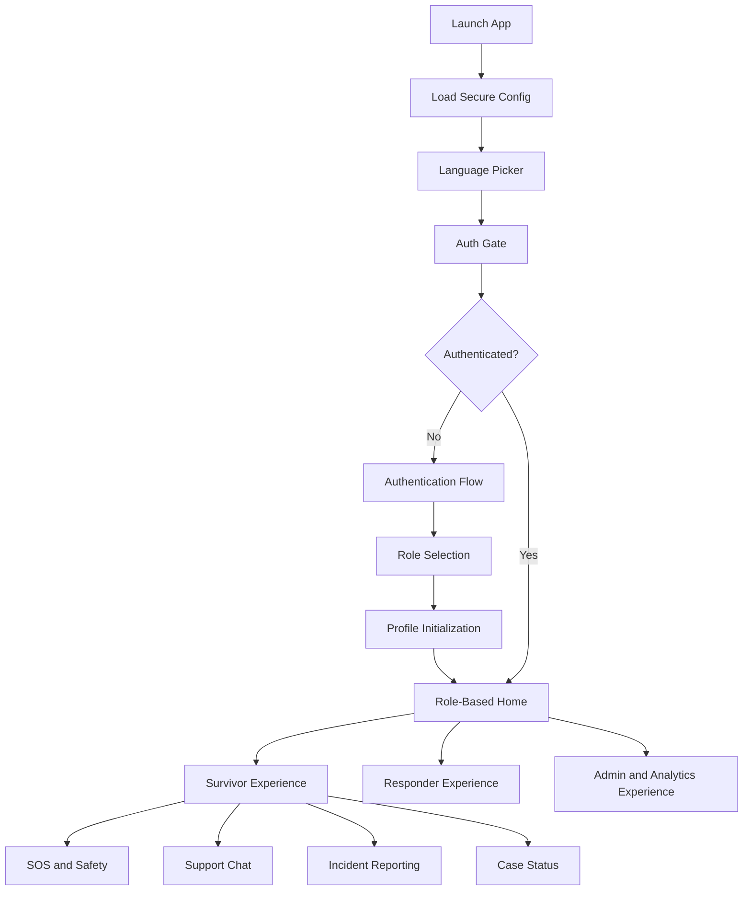

# AEGIS-AI Mobile App Replication Specification

**Purpose:** Define the complete mobile application blueprint for replicating the AEGIS-AI web app’s functionality, user journeys, workflows, safety posture, and UI/UX experience.

**Source web app:** AEGIS-AI, a full-stack TypeScript emergency response, survivor support, analytics, and coordination platform.

**Recommended mobile stack:** React Native with Expo, TypeScript, Supabase JS, Socket.IO client, secure local storage, encrypted offline cache, and optional native modules for BLE, biometrics, notifications, location, and voice recording.

---

## 1. Product Summary

AEGIS-AI is a trauma-informed GBV emergency response coordination platform. The mobile application must preserve the web app’s survivor-first design while adapting complex dashboards and workflows to smaller screens, mobile permissions, offline use, and privacy-sensitive environments.

The mobile app should support:

- **Survivor support:** Safety dashboard, SOS, AI chat, peer support, case lookup, resources, incident reporting, and voice reporting.
- **Responder operations:** Role-specific dashboards for police, NGOs, counselors, community health workers, analysts, and admins.
- **Emergency workflows:** Silent SOS, escalation, alerts, referrals, case updates, and realtime notifications.
- **Multi-channel access:** Alignment with web, USSD, WhatsApp, Supabase edge functions, and backend APIs.
- **Governance and compliance:** Audit logging, security controls, consent-aware UX, role-based access, and ethical AI transparency.
- **Localization:** Full language picker support across landing, authentication, survivor, responder, analytics, and settings flows.

---

## 2. Mobile Design Principles

### 2.1 Survivor-First Safety

The mobile app must never feel like a generic admin system for survivor users. Survivor-facing screens should be:

- Calm, non-alarming, and trauma-informed.
- Fast to understand under stress.
- Accessible in low-light and low-bandwidth conditions.
- Designed around privacy and discretion.
- Able to hide or exit quickly.
- Safe for users who may be monitored by an abuser.

### 2.2 Role-Adaptive Experience

The web app uses role-based dashboards. Mobile should use the same role model but adapt layout:

- **Survivors:** Bottom tabs and emergency-first actions.
- **Police / NGOs / counselors / CHWs:** Operational queue views and case workflows.
- **Analysts / admins:** Summary-first cards with drill-down analytics.

### 2.3 Progressive Disclosure

Complex web dashboards should not be copied one-to-one onto mobile. Instead:

1. Show critical summary cards.
2. Provide filters via bottom sheets.
3. Move charts to drill-down detail screens.
4. Keep emergency actions visible.
5. Avoid dense tables; use cards, timelines, and grouped lists.

### 2.4 Offline and Low-Connectivity Readiness

Mobile must handle poor connectivity better than the web:

- Cache safety resources offline.
- Queue non-emergency form submissions securely.
- Make emergency status clear when submission fails.
- Provide USSD/phone fallback options.
- Prefer small payloads and paginated data.

---

## 3. Source System Inventory

### 3.1 Frontend Areas

The mobile app should map the following web areas into native screens:

- **Application shell:** `.\src\App.tsx`, `.\src\main.tsx`
- **Language picker:** `.\src\components\LanguageSwitcher.tsx`
- **Authentication gate:** `.\src\components\auth\AuthGate.tsx`
- **Authentication flow:** `.\src\components\auth\AuthenticationFlow.tsx`
- **Role selection:** `.\src\components\auth\RoleSelection.tsx`
- **Profile initialization:** `.\src\components\auth\ProfileInitialization.tsx`
- **Landing page:** `.\src\pages\LandingPage.tsx`
- **Main index page:** `.\src\pages\Index.tsx`
- **Not found page:** `.\src\pages\NotFound.tsx`
- **Survivor dashboard:** `.\src\components\dashboard\SurvivorDashboard.tsx`
- **Personal dashboard:** `.\src\components\survivor\PersonalDashboard.tsx`
- **Survivor support:** `.\src\components\survivor\SurvivorSupport.tsx`
- **Survivor AI chat:** `.\src\components\survivor\SurvivorAIChat.tsx`
- **Survivor feature workspace:** `.\src\components\survivor\SurvivorFeatureWorkspace.tsx`
- **Voice incident reporter:** `.\src\components\survivor\VoiceIncidentReporter.tsx`
- **Silent SOS demo:** `.\src\components\survivor\SilentSosDemo.tsx`
- **Case status lookup:** `.\src\components\survivor\CaseStatusLookup.tsx`
- **Admin dashboard:** `.\src\components\dashboard\AdminDashboard.tsx`
- **Police dashboard:** `.\src\components\dashboard\PoliceDashboard.tsx`
- **NGO dashboard:** `.\src\components\dashboard\NgoDashboard.tsx`
- **Counselor dashboard:** `.\src\components\dashboard\CounselorDashboard.tsx`
- **CHW dashboard:** `.\src\components\dashboard\CHWDashboard.tsx`
- **Analyst dashboard:** `.\src\components\dashboard\AnalystDashboard.tsx`
- **Dashboard primitives:** `.\src\components\dashboard\DashboardPrimitives.tsx`
- **Command center:** `.\src\components\admin\CommandCenter.tsx`
- **Admin console:** `.\src\components\admin\AdminConsole.tsx`
- **Risk prediction:** `.\src\components\analytics\RiskPrediction.tsx`
- **Hotspot heatmap:** `.\src\components\analytics\HotspotHeatmap.tsx`
- **Justice analytics:** `.\src\components\analytics\JusticeAnalytics.tsx`
- **Impact dashboard:** `.\src\components\analytics\ImpactDashboard.tsx`
- **Impact charts:** `.\src\components\analytics\ImpactDashboardCharts.tsx`
- **Policy simulation:** `.\src\components\analytics\PolicySimulation.tsx`
- **Ethical governance:** `.\src\components\analytics\EthicalGovernance.tsx`
- **Reporting center:** `.\src\components\analytics\ReportingCenter.tsx`
- **Evidence vault:** `.\src\components\analytics\EvidenceVault.tsx`

### 3.2 Backend Areas

The mobile app should integrate with existing backend capabilities:

- **Server entry:** `.\server\index.ts`
- **WebSocket manager:** `.\server\websocket.ts`
- **Optimized WebSocket manager:** `.\server\websocketOptimized.ts`
- **USSD routes:** `.\server\routes\ussdRoutes.ts`
- **WhatsApp routes:** `.\server\routes\whatsappRoutes.ts`
- **Escalation routes:** `.\server\routes\escalationRoutes.ts`
- **Intelligence routes:** `.\server\routes\intelligenceRoutes.ts`
- **AGI governance routes:** `.\server\routes\agiGovernanceRoutes.ts`
- **Escalation workflow:** `.\server\workflows\escalationWorkflow.ts`
- **Risk scoring:** `.\server\intelligence\riskScoring.ts`
- **Geo matching:** `.\server\intelligence\geoMatching.ts`
- **Twilio notifications:** `.\server\notifications\twilio.ts`
- **Audit logging:** `.\server\security\auditLog.ts`
- **Encryption service:** `.\server\security\encryption.ts`
- **MFA service:** `.\server\security\mfa.ts`
- **Intrusion detection:** `.\server\security\intrusionDetection.ts`
- **Rate limiting:** `.\server\middleware\rateLimiting.ts`
- **Validation:** `.\server\middleware\validation.ts`
- **Idempotency:** `.\server\middleware\idempotency.ts`

### 3.3 Supabase Areas

The mobile app should reuse Supabase for authentication, data, realtime, RLS, and edge functions:

- **Supabase functions:** `.\supabase\functions\`
- **Supabase migrations:** `.\supabase\migrations\`
- **Peer support messages migration:** `.\supabase\migrations\20260524000000_peer_support_messages.sql`

The peer support message migration creates anonymous realtime-enabled messages with:

- Alias length limit.
- Content length limit of 1 to 280 characters.
- Flagging support.
- Seven-day expiry.
- Read access for unflagged messages.
- Insert access for anonymous and authenticated users.
- Realtime publication support.

---

## 4. Mobile Information Architecture

### 4.1 High-Level App Flow

### 4.2 Navigation Model

Use a root navigation stack with nested role-specific navigators.

#### Root Stack

- Splash / launch safety check
- Language picker
- Auth gate
- Login / register
- Role selection
- Profile setup
- Role home
- Privacy and safety settings
- Quick exit destination

#### Survivor Tabs

- **Home:** Personal dashboard, safety summary, recent updates.
- **SOS:** Silent SOS, emergency escalation, trusted contacts.
- **Support:** AI chat, peer support, counselor connection.
- **Report:** Text or voice incident reporting.
- **Case:** Case status lookup, timeline, updates.
- **Resources:** Offline support, shelter, medical, legal, police, NGO resources.

#### Responder Tabs

- **Dashboard:** Role-specific metrics.
- **Queue:** Cases, alerts, referrals, assignments.
- **Map:** Incidents, hotspot view, nearby services.
- **Messages:** Case communication and updates.
- **Profile:** Settings, security, organization.

#### Admin / Analyst Tabs

- **Command:** Operational command center.
- **Analytics:** Risk, hotspots, justice, impact.
- **Reports:** Reporting center and exports.
- **Governance:** Ethical governance, audit, AI controls.
- **Settings:** Users, roles, integrations, security.

---

## 5. Language Picker and Localization

### 5.1 Web Source

The language picker behavior comes from `.\src\components\LanguageSwitcher.tsx` and the i18n setup imported from `.\src\i18n`.

The web component supports two variants:

- **Landing variant:** A horizontal wrapped list of language buttons.
- **Compact variant:** A select dropdown with globe icon.

Mobile must preserve both ideas:

- A **first-run full-screen language picker**.
- A **compact language selector** in settings, onboarding, and landing screens.

### 5.2 Supported Language UX Requirements

The mobile app must:

1. Show language selection before or during onboarding.
2. Allow changing language after login.
3. Persist the selected language locally.
4. Sync language preference to user profile when authenticated.
5. Use native labels for language names.
6. Avoid hiding emergency help behind untranslated UI.
7. Fall back to English when a translation key is missing.
8. Support right-to-left layout if future languages require it.
9. Keep emergency and safety copy human-reviewed.
10. Support low-literacy users with icons and plain language.

### 5.3 Language Picker Screens

#### First Launch Language Picker

Purpose:

- Let users choose their preferred language before authentication.

Layout:

- App logo or discreet brand mark.
- Heading: “Choose your language”.
- Native-language button grid.
- Continue button.
- Optional “Use phone language” action.

Mobile behavior:

- Detect device locale.
- Highlight recommended device language if supported.
- Store selected language in secure or persistent local storage.
- Load translation resources before moving to the next screen.

#### Compact Language Picker

Placement:

- Top-right of public landing screen.
- Settings screen.
- Auth screen footer.
- Survivor resources screen.

Behavior:

- Opens a bottom sheet with language options.
- Shows native labels.
- Confirms instantly or after tapping “Apply”.
- Updates active screen without requiring restart.

### 5.4 Localization Scope

Every mobile screen must localize:

- Navigation labels.
- Buttons.
- Form labels.
- Error messages.
- Empty states.
- Safety resources.
- AI chat disclaimers.
- Consent text.
- Permission prompts.
- Push notification preference labels.
- Incident reporting categories.
- Case status labels.
- Dashboard metric names.

### 5.5 Mobile Language Picker Acceptance Criteria

- User can select language before login.
- User can change language after login.
- Selection persists after app restart.
- Emergency buttons remain visible and understandable.
- Survivor support content is translated.
- Case status and incident reporting flows are translated.
- Language picker is accessible by screen reader.
- Language picker supports large text.

---

## 6. Authentication and Onboarding

### 6.1 Auth Gate

Mobile equivalent of the web auth gate should:

- Check existing Supabase session.
- Validate user profile.
- Redirect unauthenticated users to auth flow.
- Redirect users without role/profile to role selection and profile setup.
- Redirect users with completed profiles to role-specific home.

### 6.2 Authentication Flow

Mobile should support:

- Email/password sign in.
- Registration.
- Password reset.
- Optional magic link.
- Optional phone authentication if enabled later.
- Session refresh.
- Logout.
- Biometric unlock after successful login.

### 6.3 Role Selection

The role selection screen should offer role cards:

- Survivor
- Counselor
- Police
- NGO
- Community health worker
- Analyst
- Admin

Each role card should include:

- Icon.
- Short explanation.
- Data/privacy note.
- Continue action.

### 6.4 Profile Initialization

Profile setup should collect role-specific fields:

#### Survivor Profile

- Preferred display name or alias.
- Preferred language.
- Safety plan status.
- Trusted contact options.
- Notification privacy preference.
- Optional location sharing preference.

#### Staff Profile

- Name.
- Role.
- Organization.
- Region.
- Contact channel.
- Verification status.
- MFA setup.

### 6.5 MFA and Security

Mobile should support or prepare for:

- TOTP setup.
- Backup codes.
- Biometric app lock.
- Session timeout.
- Device trust prompt.
- Secure logout.
- Remote session revoke.

---

## 7. Survivor Mobile Experience

### 7.1 Survivor Home

Source inspiration:

- `.\src\components\dashboard\SurvivorDashboard.tsx`
- `.\src\components\survivor\PersonalDashboard.tsx`

Primary content:

- Safety status card.
- Active case status summary.
- Recent updates.
- Safety plan progress.
- Quick actions.
- Offline resource shortcut.

Primary actions:

- Get help now.
- Open support chat.
- Report incident.
- Check case status.
- Update safety plan.
- View resources.

Mobile-specific enhancements:

- Emergency button should be reachable with one thumb.
- Add quick-exit icon in the header.
- Avoid sensitive text on visible cards unless user opts in.

### 7.2 Silent SOS

Source inspiration:

- `.\src\components\survivor\SilentSosDemo.tsx`
- `.\src\lib\silentSosBle.ts`

Mobile should support:

- Manual SOS trigger.
- Optional BLE silent SOS device integration.
- Optional volume-button or gesture trigger where platform policy allows.
- Location capture with explicit consent.
- Emergency escalation status.
- Safe cancellation window if appropriate.
- Confirmation that does not expose sensitive content.

Recommended SOS states:

- Idle.
- Preparing.
- Sending.
- Sent.
- Failed but fallback available.
- Cancelled.

### 7.3 Survivor Support

Source inspiration:

- `.\src\components\survivor\SurvivorSupport.tsx`
- `.\src\components\survivor\SurvivorAIChat.tsx`

Mobile should include:

- AI support chat.
- Crisis disclaimer.
- Peer support messages.
- Counselor handoff.
- Safety resources.
- Offline fallback text.

Chat features:

- Send message.
- Receive assistant response.
- Show loading state.
- Show service unavailable fallback.
- Clear chat.
- Report unsafe AI output.
- Escalate to human support.

Safety requirements:

- Do not display sensitive message previews in push notifications by default.
- Allow user to quickly clear visible chat.
- Avoid storing raw chat locally unless encrypted.

### 7.4 Peer Support

Source inspiration:

- `.\supabase\migrations\20260524000000_peer_support_messages.sql`

Mobile should provide:

- Anonymous alias input.
- Short supportive message composer.
- 280-character limit.
- Realtime message feed.
- Flag/report message action.
- Clear explanation that messages are anonymous and expire.

UX copy should emphasize:

- No personal identifying details.
- Be kind and supportive.
- Emergency situations require immediate local help.

### 7.5 Voice Incident Reporter

Source inspiration:

- `.\src\components\survivor\VoiceIncidentReporter.tsx`

Mobile should support:

- Microphone permission prompt.
- Record, pause, resume, stop.
- Playback before submit.
- Optional transcript if supported.
- Incident category selection.
- Consent confirmation.
- Secure upload.
- Offline queue if upload fails.

Permission copy must explain:

- Why microphone access is needed.
- Whether audio is stored.
- Who can access the report.
- How to delete or withdraw if applicable.

### 7.6 Incident Reporting

Mobile report form should include:

- Incident type.
- Date/time.
- Location or “do not share location”.
- Description.
- Evidence attachment if safe.
- Urgency level.
- Preferred contact method.
- Consent checkbox.

Mobile behavior:

- Autosave drafts locally in encrypted storage.
- Allow quick exit at any step.
- Prevent accidental submission with clear confirmation.
- Show case/reference number after submission.

### 7.7 Case Status Lookup

Source inspiration:

- `.\src\components\survivor\CaseStatusLookup.tsx`

Mobile should support:

- Case/reference number entry.
- Optional date of birth or verification token if required.
- Case status display.
- Timeline view.
- Next steps.
- Support contact options.

Statuses should be plain language, such as:

- Received.
- Under review.
- Assigned.
- Escalated.
- In progress.
- Closed.
- Needs more information.

---

## 8. Responder Mobile Experience

### 8.1 Police Dashboard

Source inspiration:

- `.\src\components\dashboard\PoliceDashboard.tsx`

Mobile should include:

- Emergency alert queue.
- Assigned cases.
- Referral updates.
- Map view.
- Case detail.
- Status update actions.
- Secure notes.

Primary actions:

- Accept alert.
- Update case status.
- Contact survivor through approved channel.
- Refer to NGO/counselor.
- Escalate emergency.

### 8.2 NGO Dashboard

Source inspiration:

- `.\src\components\dashboard\NgoDashboard.tsx`

Mobile should include:

- Referral queue.
- Survivor support requests.
- Shelter/resource capacity.
- Case notes.
- Service coordination.
- Follow-up reminders.

### 8.3 Counselor Dashboard

Source inspiration:

- `.\src\components\dashboard\CounselorDashboard.tsx`

Mobile should include:

- Assigned survivor queue.
- Support sessions.
- Follow-up tasks.
- Notes.
- Escalation to emergency services.
- Availability status.

### 8.4 Community Health Worker Dashboard

Source inspiration:

- `.\src\components\dashboard\CHWDashboard.tsx`

Mobile should include:

- Field visit tasks.
- Community alerts.
- Offline resource access.
- Referral creation.
- Location-aware service directory if consented.

### 8.5 Analyst Dashboard

Source inspiration:

- `.\src\components\dashboard\AnalystDashboard.tsx`

Mobile should include:

- High-level metrics.
- Trend cards.
- Hotspot summary.
- Risk summaries.
- Export/share controls gated by permissions.

---

## 9. Admin, Analytics, and Governance

### 9.1 Admin Dashboard

Source inspiration:

- `.\src\components\dashboard\AdminDashboard.tsx`
- `.\src\components\admin\AdminConsole.tsx`
- `.\src\components\admin\CommandCenter.tsx`

Mobile admin should include:

- User and role overview.
- System alerts.
- Operational metrics.
- Audit summaries.
- Configuration status.
- Emergency escalation monitoring.

Mobile adaptation:

- Keep destructive/admin actions behind confirmation.
- Require biometric or MFA step-up for sensitive actions.
- Use compact cards instead of tables.

### 9.2 Risk Prediction

Source inspiration:

- `.\src\components\analytics\RiskPrediction.tsx`
- `.\server\intelligence\riskScoring.ts`

Mobile should show:

- Risk level.
- Risk drivers.
- Confidence.
- Recommended actions.
- Human review notice.

### 9.3 Hotspot Heatmap

Source inspiration:

- `.\src\components\analytics\HotspotHeatmap.tsx`
- `.\server\intelligence\geoMatching.ts`

Mobile should show:

- Map view.
- Region filters.
- Time period filter.
- Incident density.
- Service availability overlay.

### 9.4 Justice Analytics

Source inspiration:

- `.\src\components\analytics\JusticeAnalytics.tsx`

Mobile should show:

- Case progression metrics.
- Resolution timelines.
- Bottleneck indicators.
- Referral outcomes.

### 9.5 Impact Dashboard

Source inspiration:

- `.\src\components\analytics\ImpactDashboard.tsx`
- `.\src\components\analytics\ImpactDashboardCharts.tsx`

Mobile should show:

- Survivors supported.
- Cases handled.
- Response times.
- Referral effectiveness.
- Trend summaries.

### 9.6 Policy Simulation

Source inspiration:

- `.\src\components\analytics\PolicySimulation.tsx`

Mobile should show:

- Scenario list.
- Parameter controls.
- Simulated outcomes.
- Assumptions and limitations.

### 9.7 Ethical Governance

Source inspiration:

- `.\src\components\analytics\EthicalGovernance.tsx`
- `.\server\routes\agiGovernanceRoutes.ts`
- `.\server\governance\agiControlFramework.ts`

Mobile should include:

- AI governance summaries.
- Risk controls.
- Human oversight status.
- Auditability indicators.
- Model limitation notices.

### 9.8 Evidence Vault

Source inspiration:

- `.\src\components\analytics\EvidenceVault.tsx`

Mobile should include:

- Evidence list.
- Secure upload.
- Metadata capture.
- Chain-of-custody status.
- Access controls.

Evidence UX must be careful:

- Warn users before uploading sensitive evidence.
- Explain who can see it.
- Allow cancellation.
- Avoid saving media unencrypted.

---

## 10. Backend Integration Matrix

| Mobile Feature    | Backend / Data Source                               | Notes                                      |
| ----------------- | --------------------------------------------------- | ------------------------------------------ |
| Auth              | Supabase Auth                                       | Reuse web auth session model.              |
| Profiles          | Supabase `profiles` table                           | Role and organization determine access.    |
| Realtime alerts   | `.\server\websocket.ts`                             | Use Socket.IO client with Supabase token.  |
| Case updates      | `case:updated`, `case:status` WebSocket events      | Subscribe to case rooms.                   |
| Role alerts       | `alert:new`, `emergency:escalation` events          | Join role/org rooms after auth.            |
| Survivor chat     | Supabase function / backend chat service            | Must support failure fallback.             |
| Peer support      | `peer_support_messages` table                       | Anonymous realtime feed.                   |
| USSD fallback     | `.\server\routes\ussdRoutes.ts`                     | Provide “use USSD instead” option.         |
| WhatsApp fallback | `.\server\routes\whatsappRoutes.ts`                 | Provide WhatsApp support route if enabled. |
| Escalations       | `.\server\routes\escalationRoutes.ts`               | SOS and high-risk reports.                 |
| Risk scoring      | `.\server\routes\intelligenceRoutes.ts`             | Role-gated.                                |
| Governance        | `.\server\routes\agiGovernanceRoutes.ts`            | Admin/analyst only.                        |
| Notifications     | `.\server\notifications\twilio.ts` and push service | Mobile push layer should be added.         |

---

## 11. Realtime Requirements

Source inspiration:

- `.\server\websocket.ts`

The WebSocket layer supports:

- Supabase token authentication.
- User room: `user:<id>`.
- Role room: `role:<role>`.
- Organization room: `org:<organizationId>`.
- Case room: `case:<caseId>`.
- Alert room: `alerts:<role>` and `alerts:<organizationId>`.
- Events including `case:updated`, `alert:new`, `emergency:escalation`, `assignment:new`, and `case:status`.

Mobile should:

1. Connect after authentication.
2. Pass Supabase access token in Socket.IO auth payload.
3. Subscribe to relevant cases.
4. Subscribe to alerts by role.
5. Reconnect automatically.
6. Show stale/offline state when disconnected.
7. Avoid showing sensitive alert contents in lock-screen notifications.

---

## 12. Security and Privacy Requirements

### 12.1 Mobile Secure Storage

Store securely:

- Supabase session.
- Refresh token.
- User language preference.
- App lock setting.
- Offline drafts.
- Emergency contacts.
- Cached case summaries.

Use:

- iOS Keychain.
- Android Keystore.
- Encrypted SQLite or encrypted file storage for larger local data.

### 12.2 App Lock

Support:

- PIN.
- Biometrics.
- Auto-lock after inactivity.
- Lock on background.
- Optional decoy screen.

### 12.3 Push Notification Privacy

Default notifications should be discreet:

- Avoid “GBV”, “case”, “police”, “survivor”, or “emergency” in lock-screen previews.
- Let users choose notification style:
  - Off.
  - Silent.
  - Generic.
  - Detailed.

### 12.4 Quick Exit

Every survivor-facing screen should include quick exit:

- Header icon.
- Optional gesture.
- Clears sensitive navigation stack.
- Opens neutral screen or exits app.

### 12.5 Consent

Consent must be explicit for:

- Location sharing.
- Microphone recording.
- Evidence upload.
- AI support chat.
- Emergency contact sharing.
- Push notifications.

---

## 13. Offline Mode

### 13.1 Offline Survivor Resources

Cache:

- Emergency contacts.
- Safety planning guidance.
- Legal resources.
- Medical resources.
- Shelter/NGO resources.
- USSD instructions.
- WhatsApp support instructions.

### 13.2 Offline Incident Drafts

Allow:

- Save draft.
- Edit draft.
- Delete draft.
- Submit when online.

Do not allow silent emergency failure. If emergency submit fails:

- Show clear failed status.
- Offer phone/USSD fallback.
- Offer retry.

### 13.3 Offline Dashboard

For staff:

- Show last synced timestamp.
- Disable risky actions if server confirmation is required.
- Queue safe updates only if idempotency is supported.

---

## 14. Mobile Screen Catalog

### Public and Onboarding Screens

1. Splash screen.
2. First-run language picker.
3. Public landing screen.
4. Auth screen.
5. Registration screen.
6. Password reset screen.
7. Role selection screen.
8. Profile initialization screen.
9. Privacy and consent introduction.

### Survivor Screens

1. Survivor home.
2. Safety plan setup.
3. SOS screen.
4. SOS sending status.
5. Support hub.
6. AI chat.
7. Peer support feed.
8. Peer message composer.
9. Incident report form.
10. Voice incident reporter.
11. Evidence attachment.
12. Case status lookup.
13. Case timeline.
14. Resource directory.
15. Offline resources.
16. Notification privacy settings.
17. Quick exit destination.

### Staff Screens

1. Role dashboard.
2. Case queue.
3. Case detail.
4. Alert detail.
5. Referral creation.
6. Secure notes.
7. Assignment detail.
8. Map view.
9. Messages.
10. Availability settings.

### Admin / Analyst Screens

1. Command center.
2. Admin overview.
3. User management.
4. System health.
5. Audit summaries.
6. Risk prediction.
7. Hotspot map.
8. Justice analytics.
9. Impact dashboard.
10. Policy simulation.
11. Ethical governance.
12. Evidence vault.
13. Reporting center.

### Settings Screens

1. Language picker.
2. Security and app lock.
3. Notification privacy.
4. Data and storage.
5. Accessibility.
6. Help and support.
7. Logout.

---

## 15. Component Mapping

| Web Pattern             | Mobile Equivalent                     |
| ----------------------- | ------------------------------------- |
| Sidebar                 | Bottom tabs or drawer                 |
| Breadcrumb              | Native header title and back stack    |
| Desktop table           | Card list with filters                |
| Modal dialog            | Bottom sheet or full-screen modal     |
| Toast                   | Snackbar / native toast               |
| Hover tooltip           | Info icon or helper text              |
| Multi-column dashboard  | Vertical card stack                   |
| Large charts            | Summary card plus detail chart screen |
| Select dropdown         | Native picker or bottom sheet         |
| Landing language pills  | Full-screen language grid             |
| Compact language select | Settings bottom-sheet picker          |
| Evidence upload card    | Native media/file picker              |
| Voice recorder          | Native recorder controls              |
| BLE silent SOS demo     | Native BLE pairing and status screen  |

---

## 16. Accessibility Requirements

Mobile app must support:

- Screen reader labels.
- Large text.
- High contrast mode.
- Reduced motion.
- Touch targets at least 44x44 points.
- Plain-language error messages.
- Offline-readable help.
- Color-independent statuses.
- Keyboard support on tablets.
- Voice input where appropriate.

Language picker accessibility:

- Each language option must announce native label and selected state.
- “Use phone language” must announce detected language.
- Emergency actions must remain reachable regardless of language selection.

---

## 17. Performance Requirements

The web build logs show large chunks, especially React core and charts. Mobile should avoid loading everything upfront.

Mobile performance rules:

- Lazy-load role dashboards.
- Lazy-load analytics screens.
- Defer chart rendering.
- Paginate case lists.
- Cache dictionaries/translations.
- Use skeleton loading states.
- Use optimistic UI only for safe non-emergency operations.
- Keep survivor SOS screen lightweight and always fast.

---

## 18. Testing Strategy

### 18.1 Functional Tests

Test:

- Language picker persistence.
- Auth redirects.
- Role selection.
- Profile initialization.
- Survivor dashboard actions.
- SOS happy path and failure path.
- AI chat success and fallback.
- Peer support insert/read.
- Incident report creation.
- Voice recording permission denial.
- Case lookup.
- Realtime alert connection.

### 18.2 Safety Tests

Test:

- Quick exit from every survivor screen.
- App lock on background.
- Notification privacy defaults.
- Offline emergency fallback.
- Draft deletion.
- Chat clearing.

### 18.3 Accessibility Tests

Test:

- Screen reader labels.
- Language picker navigation.
- Large text layout.
- Contrast.
- Touch target sizes.

### 18.4 Security Tests

Test:

- Token storage.
- Session expiration.
- Role-based route guards.
- Unauthorized API access.
- Offline cache encryption.
- Evidence upload permissions.

---

## 19. Implementation Roadmap

### Phase 1: Mobile Foundation

- Expo React Native project.
- Supabase Auth integration.
- i18n setup.
- First-run language picker.
- Secure storage.
- Root navigation.
- Role-based routing.

### Phase 2: Survivor MVP

- Survivor home.
- Safety resources.
- SOS.
- Support chat.
- Peer support.
- Incident report form.
- Case lookup.
- Notification privacy settings.

### Phase 3: Staff MVP

- Police dashboard.
- NGO dashboard.
- Counselor dashboard.
- CHW dashboard.
- Case queue.
- Alert queue.
- Case detail.
- Realtime updates.

### Phase 4: Admin and Analytics

- Admin overview.
- Command center.
- Risk prediction.
- Hotspot map.
- Impact dashboard.
- Justice analytics.
- Reporting center.

### Phase 5: Advanced Native Capabilities

- Voice incident reporter.
- BLE silent SOS.
- Biometric lock.
- Encrypted offline drafts.
- Push notifications.
- Evidence upload.
- Deep links from notifications.

---

## 20. Open Product Decisions

Before implementation, decide:

1. Should the app name/icon be discreet by default?
2. Which languages must ship in v1?
3. Should survivor users be allowed anonymous/no-account mode?
4. Should SOS require confirmation or be instant?
5. Which push notification style is safest by default?
6. Should peer support be available to anonymous users in mobile v1?
7. How should evidence deletion/retention work?
8. What local emergency numbers and regional services should be bundled offline?
9. Should staff users require MFA before accessing mobile dashboards?
10. Should analytics be available on phones or tablet-only?

---

## 21. Definition of Done for Mobile Parity

The mobile app can be considered functionally equivalent to the web app when:

- Users can authenticate and complete role/profile setup.
- Language picker works before and after login.
- Survivor users can access dashboard, SOS, support, reporting, resources, and case lookup.
- Staff roles can view and act on role-specific queues.
- Admin/analyst roles can view operational and analytics summaries.
- Realtime case updates and alerts work.
- Peer support messages work with anonymous alias and realtime feed.
- Voice incident reporting is available or explicitly deferred.
- Offline resources are available.
- Notification privacy is configurable.
- App lock and quick exit are implemented.
- Role-based access control matches the web app.
- Mobile UX has been tested for accessibility, privacy, and low-connectivity behavior.

---

## 22. Immediate Next Engineering Tasks

1. Create a new mobile workspace or package.
2. Extract shared TypeScript types from the web app.
3. Mirror role definitions and route guards.
4. Implement i18n and the first-run language picker.
5. Implement Supabase auth.
6. Implement survivor home and SOS screens.
7. Connect support chat and peer support.
8. Implement case lookup.
9. Add Socket.IO realtime client.
10. Add secure storage and app lock.
11. Add notification privacy preferences.
12. Add offline resource cache.
